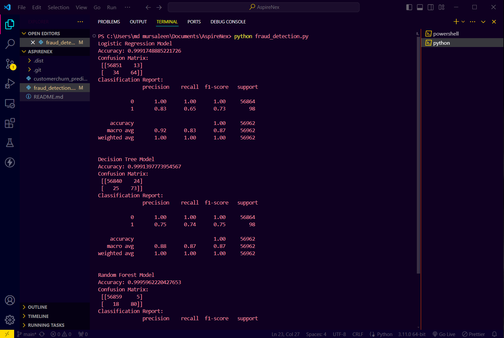
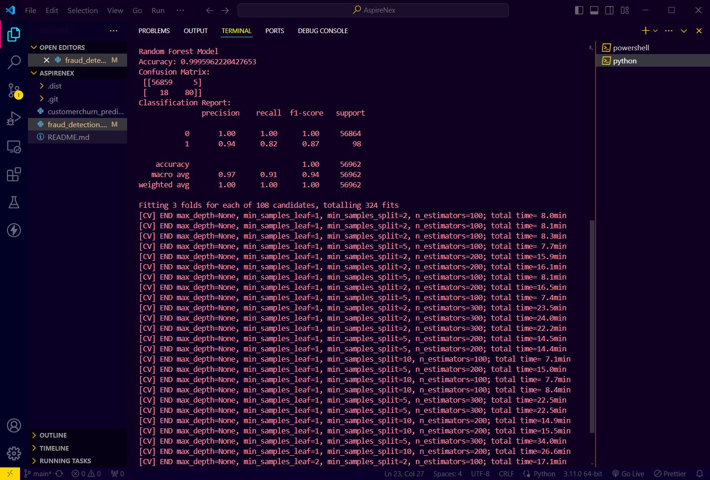

# Credit Card Fraud Detection

This project aims to detect credit card fraud using various machine learning models, including Logistic Regression, Decision Tree and Random Forest. The models are trained and evaluated on a dataset containing transactions made by credit cards. The dataset is highly unbalanced, containing many more non-fraudulent transactions than fraudulent ones.

## Dataset

The dataset can be downloaded from [`Kaggle`](https://www.kaggle.com/datasets/mlg-ulb/creditcardfraud). It contains 284,807 transactions, of which 492 are fraudulent (Class = 1) and the rest are non-fraudulent (Class = 0). The dataset includes 30 features: 

- 28 anonymized numerical features (V1 to V28)
- 'Time' which is the seconds elapsed between this transaction and the first transaction in the dataset
- 'Amount' which is the transaction amount
- 'Class' which is the target variable (0 for non-fraudulent, 1 for fraudulent)

## Prerequisites

To run the code, you need to have the following libraries installed:

- pandas
- numpy
- scikit-learn
- matplotlib
- seaborn

## Project Structure

The project is structured as follows:

- `creditcard.csv`: The dataset file containing credit card transactions.
- `fraud_detection.py`: The main script to preprocess the data, train models, and evaluate their performance.
- `README.md`: This file, providing an overview and instructions for the project.

## Models

Three machine learning models are trained and evaluated:

1. **Logistic Regression**
2. **Decision Tree**
3. **Random Forest**

## Evaluation

The models are evaluated using the following metrics:

- Accuracy
- Confusion Matrix
- Classification Report (Precision, Recall, F1-Score)

The script prints the evaluation results for each model and plots the feature importance determined by the Random Forest model.

## Usage

1. **Download the Dataset**: Ensure you have downloaded the dataset from Kaggle and placed it in the appropriate directory (`c:\Users\md mursaleen\Downloads\creditcard.csv`).

2. **Install Required Libraries**: Install the necessary Python libraries using pip:

   ```sh
   pip install pandas numpy scikit-learn matplotlib seaborn

3. **To run the project, follow these steps**:

    Clone the repository:
   
    ```sh
        git clone https://github.com/Md-Mursaleen/CreditCard-Fraud-Detection.git
    ```

    Install dependencies:
    
    ```sh
        pip install pandas scikit-learn
    ```

    Run the script:
    
    ```sh
        python fraud_detection.py
    ```
    
## Output



